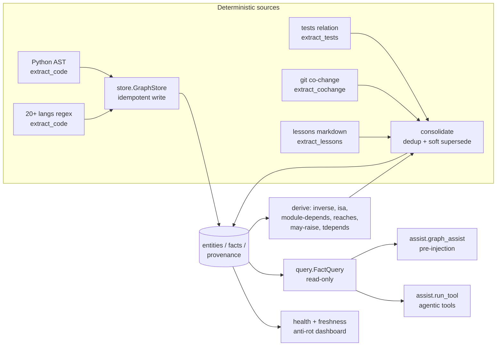

# Architecture

One SQLite file, three tables, three trust tiers, two read surfaces.

## Module map

| module | responsibility |
|---|---|
| `store.py` | the only write path; WAL, transactions, idempotent inserts, SOFT supersession |
| `types.py` | frozen row types (`ExtractedFact`, `ProposedFact`, `FactRow`, …) |
| `consolidate.py` | dedup + corroboration + single-valued conflict resolution + stale pruning |
| `walk.py` | repo walker; excludes caches/build output and prunes nested git checkouts |
| `extract_code.py` | AST facts (Python) + regex facts (other languages), file:line provenance |
| `extract_tests.py` | fail-closed `tests` relation (import AND reference required) |
| `extract_cochange.py` | git co-change with mega-commit blast-radius bounding |
| `extract_lessons.py` | markdown notes → `lesson` / `because` / `cites` facts |
| `derive.py` | inverse edges, transitive `isa`, module depends, bounded `reaches` |
| `derive_exceptions.py` | `may-raise` propagation with proof paths |
| `derive_tdepends.py` | transitive module dependencies (phase 2 — reads phase-1 output) |
| `health.py` | tiers, decay, duplicates/orphans/contradictions dashboard |
| `freshness.py` | git-grounded source staleness (commits behind upstream) |
| `query.py` | `FactQuery.query_facts` / `explain_entity` — the read path |
| `assist.py` | serve-time recall: pre-injection + agentic tools + instrumentation |
| `__main__.py` | CLI: `build` / `status` / `query` / `explain` / `assist` / `tool` |

## Design decisions

**Soft supersession, never DELETE.** A fact that stops being true gets
`valid_to` + `superseded_by` set. The row survives for audit and `as_of`
time-travel. Pruning (source file vanished) archives the same way, with no
winner.

**Two-phase derivation.** Phase 1 (inverse/isa/module/reaches/may-raise)
reads only base facts. Transitive module dependencies read the module facts
phase 1 *produces*, so they run after phase 1 is consolidated. Ordering is
data-dependency, not convention.

**Deterministic tier outranks.** In a single-valued slot, a `det:` fact is
never retired by a lower-tier candidate. Corroboration raises confidence but
caps at 0.99 — the 1.0 floor is reserved for ground truth.

**Bounded everything, logged truncation.** Every closure/BFS is cycle-safe,
depth-bounded, and fan-out-capped; hitting a cap logs a warning. A silent
cap reads as "covered everything" when it did not.

**Idempotent builds.** Re-running over an unchanged repo writes zero new
facts (dedup on the current triple), so a scheduler can run it on every
change event for free.

**Zero dependencies.** `ast`, `sqlite3`, `re`, `subprocess` (git). This is
a deliberate posture, not an accident: agent memory infrastructure belongs
inside the trust boundary, and the cheapest supply chain to audit is the one
that does not exist.

## Deployment pattern (event-driven freshness)

The intended long-running deployment is a check-then-act loop, not a timer
rebuild: every N minutes, `git fetch` each source repo and compare HEAD to
upstream; when nothing is behind, do nothing (a near-free no-op); when
something changed, fast-forward clean repos only (never touch a dirty
working tree), rebuild, and re-run the dashboard. Pair it with a
single-instance lock so overlapping runs skip instead of stacking on the
same database file.
